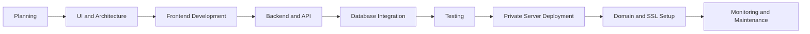

<!-- Replace the current subtitle with this -->

<h3 align="center">
  Software Engineer • Full-Stack Developer • SaaS Builder • Server & Deployment Manager
</h3>

<p align="center">
  
</p>

---

## 👨‍💻 About Me

I am a Software Engineer and Full-Stack Web Developer from Dhaka, Bangladesh. I build, deploy and maintain scalable SaaS products, business websites, REST APIs and production-ready web applications.

Alongside application development, I have practical experience managing private servers and hosting production projects on VPS infrastructure. Most of my live projects are deployed and maintained on privately managed servers.

* 🔭 Currently building and improving **SaaS products**
* 💻 Building full-stack applications with **Django, React and TypeScript**
* 🖥️ Managing **private servers and production deployments**
* 🚀 Hosting and maintaining projects on **Linux-based VPS infrastructure**
* 🌐 Working with domains, DNS, SSL certificates and web server configuration
* 🗄️ Managing application databases and production environments
* 🔧 Troubleshooting server, deployment and application-level issues
* 👯 Open to collaborating on meaningful **open-source and SaaS projects**
* 🎯 Focused on clean architecture, security, performance and scalability
* 📍 Based in **Dhaka, Bangladesh**

---

## 🛠️ Technologies and Tools

### Programming Languages

<p align="left">
  
</p>

### Frameworks and Libraries

<p align="left">
  
</p>

### Databases

<p align="left">
  
</p>

### Server, DevOps and Deployment

<p align="left">
  
</p>

* Linux-based private VPS management
* Production application deployment
* Django and React application hosting
* Nginx web server configuration
* Docker-based application management
* Domain and DNS configuration
* SSL certificate configuration
* PostgreSQL and MySQL database management
* Environment variable and production configuration
* Server troubleshooting and application monitoring
* GitHub-based deployment workflow
* Website migration and server maintenance

---

## 🖥️ Server Management Experience

<details>
  <summary><strong>🚀 Production Deployment</strong></summary>
  <br />
  I deploy Django, React, TypeScript and SaaS applications to production environments, configure application services and ensure that websites remain accessible and stable.
</details>

<details>
  <summary><strong>🐧 Linux Server Management</strong></summary>
  <br />
  I manage Linux-based private servers, application directories, permissions, services, environment variables and production configurations.
</details>

<details>
  <summary><strong>🌐 Domain, DNS and SSL</strong></summary>
  <br />
  I configure domains, subdomains, DNS records, reverse proxies and SSL certificates for secure HTTPS access.
</details>

<details>
  <summary><strong>⚙️ Web Server Configuration</strong></summary>
  <br />
  I configure and manage web servers and reverse proxies for hosting frontend applications, backend APIs and multiple websites on private infrastructure.
</details>

<details>
  <summary><strong>🗄️ Database and Application Management</strong></summary>
  <br />
  I work with production databases, application migrations, server-side configurations and deployment-related troubleshooting.
</details>

<details>
  <summary><strong>🔧 Maintenance and Troubleshooting</strong></summary>
  <br />
  I diagnose server errors, deployment failures, domain issues, SSL problems, application crashes and configuration conflicts.
</details>

---

## 🚀 What I Can Deliver

```text
✓ SaaS Application Development
✓ Full-Stack Web Development
✓ Django REST API Development
✓ React and TypeScript Applications
✓ Private VPS Server Management
✓ Production Application Deployment
✓ Linux Server Configuration
✓ Nginx Reverse Proxy Configuration
✓ Domain, DNS and SSL Configuration
✓ Database Setup and Management
✓ Website Migration
✓ Server Troubleshooting
✓ Business and Service Websites
✓ Authentication and Admin Systems
✓ Third-Party API Integration
✓ Workflow Automation
```

---

## 🌐 Production and Live Projects

Most of these projects are deployed, configured or maintained through production hosting environments, including privately managed servers.

| Project                         | Type                                    | Live Website                                             |
| ------------------------------- | --------------------------------------- | -------------------------------------------------------- |
| **IncludeWork**                 | Business and virtual assistant platform | [Visit Website](https://includework.com/)                |
| **ExpensePro**                  | SaaS expense management application     | [Visit Website](https://expensepro.app/)                 |
| **SF Email Verifier**           | Email verification SaaS platform        | [Visit Website](https://sfemailverifier.com/)            |
| **Royal Food House**            | Restaurant website                      | [Visit Website](https://royal-food-house.vercel.app/)    |
| **Burger King Demo**            | Restaurant landing page                 | [Visit Website](https://burger-king-hadi.vercel.app/)    |
| **Latin House**                 | Restaurant website                      | [Visit Website](https://latin-house-hadi.vercel.app/)    |
| **Developer Portfolio**         | Personal portfolio                      | [Visit Website](https://md-sabbir-hossain.vercel.app/)   |
| **R.D. Builders LLC**           | Construction business website           | [Visit Website](https://rdbuildersllc.com/)              |
| **North Peak Roofing**          | Roofing business website                | [Visit Website](https://northpeakroof.com/)              |
| **Le Sage Painting**            | Painting service website                | [Visit Website](https://lesagepainting.com/)             |
| **Mark's Handyman Service**     | Handyman service website                | [Visit Website](https://markshandymanservice.com/)       |
| **True Craftsman Exteriors**    | Exterior service website                | [Visit Website](https://www.truecraftsmanexteriors.com/) |
| **Top Notch Roofing Solutions** | Roofing service website                 | [Visit Website](https://topnotchrs.com/)                 |
| **A&B Screen Porch**            | Outdoor construction website            | [Visit Website](https://anbscreenporch.com/)             |
| **R3 Roofing Utah**             | Roofing business website                | [Visit Website](https://www.r3roofingutah.com/)          |
| **BlackRock Networking**        | IT and networking website               | [Visit Website](https://blackrocknetworking.com/)        |
| **Vulcan Utah**                 | Professional service website            | [Visit Website](https://vulcanutah.com/)                 |
| **Tate Construction Utah**      | Construction business website           | [Visit Website](https://tateconstruction-utah.com/)      |

---

## 💡 My Development and Deployment Workflow



---

<p align="center">
  <strong>I do not only build applications. I deploy, configure and maintain them in production.</strong>
</p>
